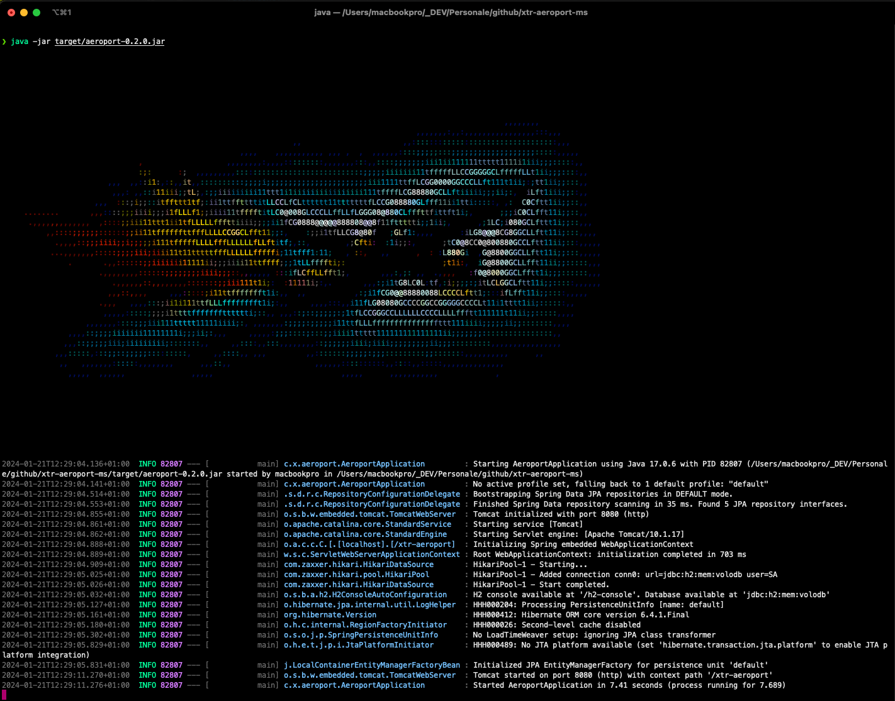
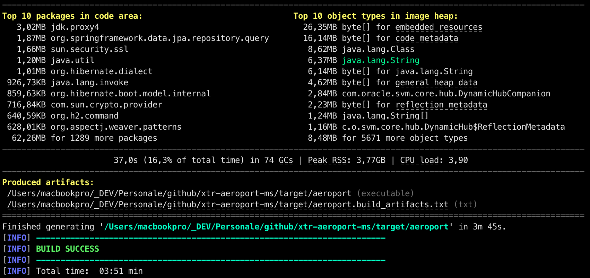
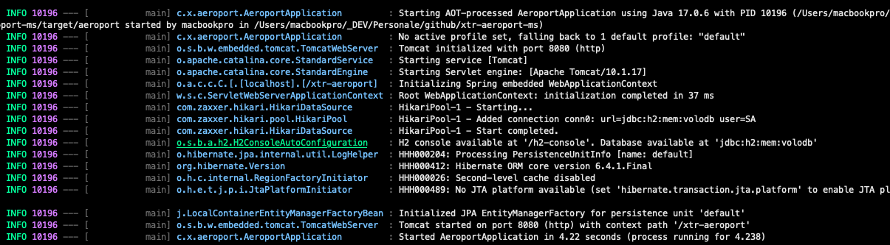
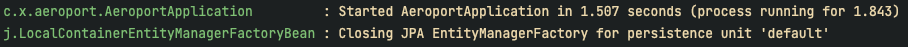
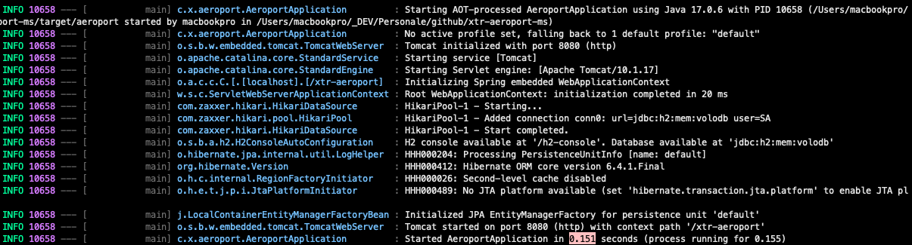
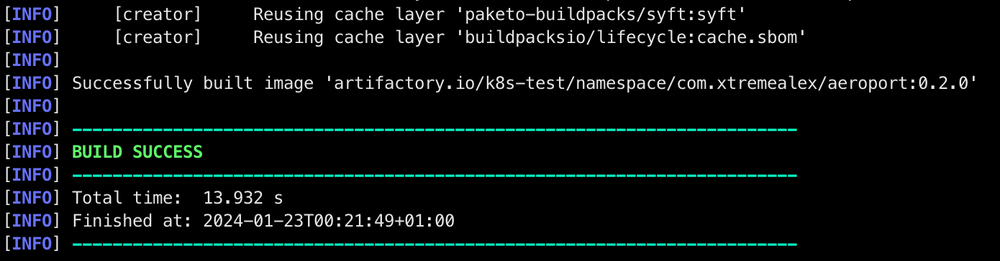
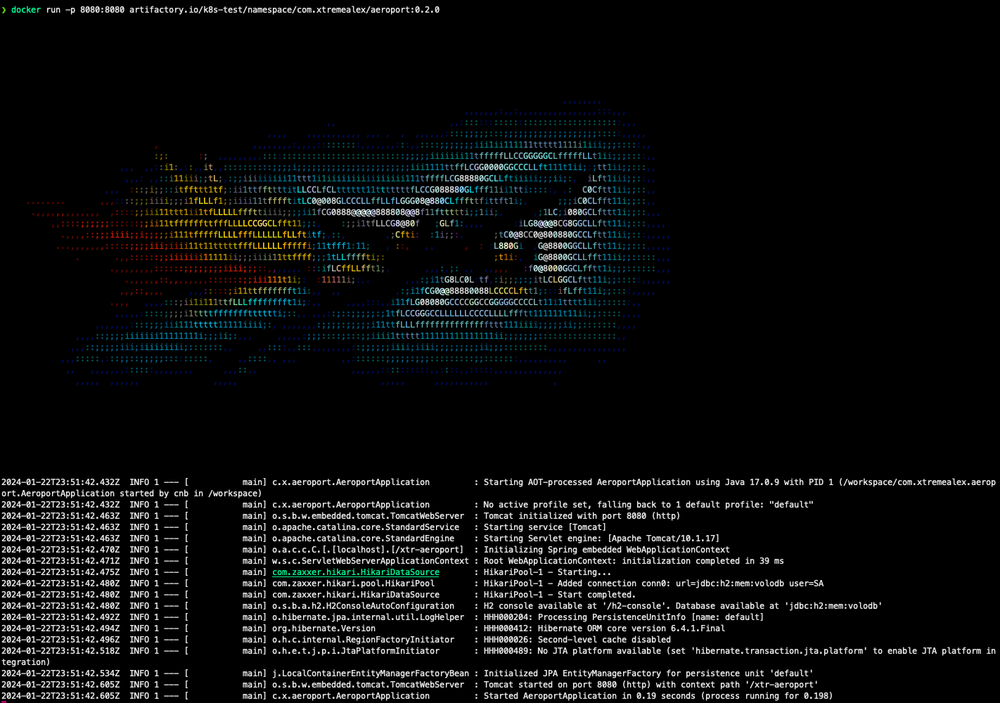

<a name="readme-top"></a>

<div align="center">
  
  <br /><br />
  
</div>

# xtr-aeroport-typological

Microservizio dedicato all'accesso alle informazioni tipologiche sugli aeroporti e le rotte aeree a livello globale.

## Info sul progetto

Questo progetto nasce come piattaforma sperimentale personale per mettere alla prova tecnologie e framework moderni in un contesto realistico. L'obiettivo è fornire un set di API robuste per accedere a informazioni dettagliate sugli aeroporti e le rotte aeree, con particolare attenzione alla compilazione nativa GraalVM.

È uno dei moduli di una serie più ampia, pensata per essere condivisa e arricchita con il contributo della community.

Fa parte della suite `xtr-aeroport-*`:

- `xtr-aeroport-ms` — microservizio di accesso ai dati
- `xtr-aeroport-batch` — import massivo dati
- `xtr-aeroport-typological` — dati tipologici (questo modulo)
- `xtr-aeroport-common-lib` — libreria condivisa

## Stack tecnologico

- Java 17 (GraalVM)
- Spring Boot 3.2.1
- Maven
- Linux, macOS, Windows

## Getting Started

Il progetto usa Maven per la gestione delle dipendenze e la compilazione. È sviluppato con Spring Boot 3 e Java 17 e può essere avviato e testato in locale.

### Prerequisiti

- Git (>= 2.43)
- Java OJDK (GraalVM versione 17)
- Maven (Apache Maven >= 3.9.6)

### Coordinate del progetto

| Proprietà | Valore |
|---|---|
| artifactId | `typological` |
| version | `1.2.0` |
| main class | `com.xtremealex.aeroport.AeroportApplication` |
| porta | `8080` |

### Clonare e compilare

1. Clona il repository:
   ```bash
   git clone https://github.com/XtremeAlex/xtr-aeroport-typological.git
   cd xtr-aeroport-typological
   ```

2. Compila il progetto con Maven:
   ```bash
   mvn clean package -DskipTests
   ```
   

3. Avvia l'applicazione:
   ```bash
   java -jar ./target/aeroport-*.jar
   ```
   

### Build nativa (GraalVM)

**1. Generare i metadati per la native-image**

Per risolvere i problemi di reflection va lanciato, prima di qualsiasi compilazione nativa, il `native-image-agent` che genera i metadati eseguendo il jar sulla JVM:

```bash
java -agentlib:native-image-agent=config-output-dir=./src/main/resources/META-INF/native-image -jar ./target/*.jar com.xtremealex.aeroport.AeroportApplication
```


Il plugin genera diversi file `.json`, ognuno con informazioni specifiche sull'aspetto del codice da compilare. Se si crea una cartella sotto `resources/META-INF/native-image` non serve aggiungere i `buildArgs`: di default vengono cercati lì. In alternativa si possono dichiarare esplicitamente:

```
<buildArg>-H:ReflectionConfigurationFiles=configs/native-image/reflect-config.json</buildArg>
<buildArg>-H:JNIConfigurationFiles=configs/native-image/jni-config.json</buildArg>
<buildArg>-H:DynamicProxyConfigurationFiles=configs/native-image/proxy-config.json</buildArg>
<buildArg>-H:ResourceConfigurationFiles=configs/native-image/resource-config.json</buildArg>
<buildArg>-H:SerializationConfigurationFiles=configs/native-image/serialization-config.json</buildArg>
```

**2. Opzioni buildArgs principali (nel pom)**

Ogni opzione ha uno scopo specifico per ottimizzare e configurare la compilazione:

- `--verbose` — abilita messaggi dettagliati durante la compilazione (utile per il debug).
- `-Dspring.aot.enabled=true` — abilita l'ottimizzazione Ahead-of-Time di Spring (avvio più veloce, meno memoria).
- `-H:TraceClassInitialization=true` — traccia l'inizializzazione delle classi per identificare quelle problematiche.
- `-H:+ReportExceptionStackTraces` — stampa lo stack trace delle eccezioni in caso di errori di compilazione.
- `-H:Name=aeroport` — imposta il nome del file eseguibile finale.
- `-H:DashboardDump=aeroport-dump` / `-H:+DashboardAll` — dati per il dashboard di GraalVM.
- `--initialize-at-build-time=org.slf4j.LoggerFactory,ch.qos.logback,...` — classi/pacchetti inizializzati a build time.
- `--initialize-at-run-time=framework` — framework personalizzati inizializzati a runtime.
- `-Dspring.graal.remove-unused-autoconfig=true` — rimuove le autoconfigurazioni inutilizzate per ridurre l'immagine.
- `-Dspring.graal.remove-yaml-support=true` — disabilita il supporto YAML per ridurre ulteriormente l'immagine.

**3. Compilare l'immagine nativa**

```bash
mvn package -DskipTests -Pnative
```



Il binario viene prodotto in `./target/aeroport` (su Windows `aeroport.exe`).


**4. Avviare l'applicazione nativa**

```bash
./target/aeroport
```



I tempi di avvio si dimezzano (`4.22s`) pur con l'init che importa i valori JSON nell'H2. Disabilitando l'init la differenza è ancora più marcata, con benefici assoluti in ambiente cloud:

- JVM no-init: `1.507s`

  

- Nativo no-init: `0.151s` — si avvia circa 10 volte più velocemente usando meno risorse.

  

**Recap dei comandi**

```bash
mvn clean
mvn package -DskipTests
java -agentlib:native-image-agent=config-output-dir=src/main/resources/META-INF/native-image -jar ./target/*.jar com.xtremealex.aeroport.AeroportApplication
mvn package -DskipTests -Pnative
./target/aeroport
```

### Build Docker

```bash
mvn package -DskipTests -Pnative && mvn package -DskipTests -Pdocker-m1-arm
docker run -p 8080:8080 artifactory.io/k8s-test/namespace/com.xtremealex/aeroport:0.2.0
```




## Play & Test

**Controller**

1. `getAirportsBy`
   ```java
   @GetMapping("/getAirportsBy")
   public ResponseEntity<?> getAirportsBy(@RequestParam(required = false) Set<String> types,
                                          @RequestParam(required = false) String isoCountry,
                                          @RequestParam(required = false) String name,
                                          @RequestParam(defaultValue = "0") int pageNumber,
                                          @RequestParam(defaultValue = "12") int pageSize,
                                          @RequestParam(required = false) String sortField,
                                          @RequestParam(defaultValue = "ASC") String sortDir) {
       // code...
   }
   ```
   ```
   URL: http://localhost:8080/xtr-aeroport/getAirportsBy?pageNumber=0&pageSize=4&sortField=name&types=1,2,3,4,5,6,7,8,9
   ```

2. `searchAirports`
   ```java
   @PostMapping("/searchAirports")
   public ResponseEntity<?> searchAirports(@RequestBody AirportSearchRequest searchRequest) {
       // code...
   }
   ```
   ```
   URL: http://localhost:8080/xtr-aeroport/searchAirports
   ```

## Roadmap

- [x] Creare Verticale SearchAirport
- [x] Creare Verticale SearchAirportType
- [x] Sostituire ModelMapper con MapStruct
- [x] Compilare nativamente con GraalVM

Consulta le [open issues](https://github.com/XtremeAlex/xtr-aeroport-typological/issues) per la lista completa di funzionalità proposte e bug noti.

## Come contribuire

I contributi sono ciò che rende la community open source un posto straordinario per imparare e creare. Ogni contributo è molto apprezzato.

1. Fai un fork del progetto
2. Crea il tuo feature branch (`git checkout -b feature/nome-feature`)
3. Fai commit delle modifiche (`git commit -m "Aggiunge nome-feature"`)
4. Fai push sul branch (`git push origin feature/nome-feature`)
5. Apri una Pull Request

Se hai un suggerimento, apri pure una issue con il tag appropriato. E non dimenticare di mettere una stella al progetto!

## License

Distribuito con doppia licenza: **GNU AGPL-3.0** (vedi [`LICENSE`](LICENSE)) per uso open source, e **licenza commerciale** per uso in prodotti proprietari (vedi [`COMMERCIAL-LICENSE.md`](COMMERCIAL-LICENSE.md)).

## Contatti

Andrei Alexandru Dabija — [LinkedIn](https://www.linkedin.com/in/andrei-alexandru-dabija/) — [github.com/XtremeAlex](https://github.com/XtremeAlex)
